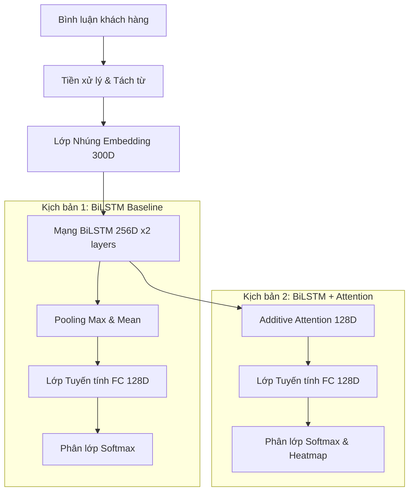

# 📊 Báo Cáo Đánh Giá và Thực Nghiệm (Evaluation & Experimentation Report)
## BrandHealth AI — Giám sát Sức khỏe Thương hiệu từ Phản hồi Khách hàng

Báo cáo này trình bày chi tiết về môi trường đánh giá, cách thức triển khai, các kịch bản thực nghiệm và phân tích đối sánh chi tiết giữa hai phương pháp: **BiLSTM (Baseline)** và **BiLSTM + Attention (Cải tiến)** dựa trên dữ liệu thu được từ 10 lượt chạy thực nghiệm độc lập.

---

### 1. Môi Trường Đánh Giá & Cấu Hình Hệ Thống

Để đảm bảo tính nhất quán và tính khoa học trong việc so sánh, toàn bộ quá trình huấn luyện và đánh giá được thực hiện trên cùng một cơ sở hạ tầng đồng nhất:

*   **Hệ điều hành**: Linux (Kernel `6.6.122+-x86_64`) - Môi trường ảo hóa đám mây
*   **Phần cứng**:
    *   **GPU**: 1x NVIDIA Tesla T4 (Dung lượng VRAM khả dụng: `14.56 GB`)
    *   **CPU**: Intel(R) Xeon(R) CPU @ 2.20GHz
    *   **RAM hệ thống**: `12.7 GB`
*   **Môi trường Phần mềm**:
    *   **Ngôn ngữ**: Python `3.12.13`
    *   **Framework**: PyTorch `2.10.0+cu128` (Tăng tốc phần cứng qua CUDA 12.8)
    *   **Thư viện phân tích & NLP**:
        *   `underthesea>=6.8.0` (Phân tách từ tiếng Việt)
        *   `scikit-learn>=1.3.0` (Tính toán các chỉ số đánh giá)
        *   `pandas>=2.0.0`, `numpy>=1.24.0`
    *   **Thư viện trực quan hóa**: `matplotlib>=3.7.0`, `seaborn>=0.12.0`

---

### 2. Thiết Lập Thực Nghiệm & Cách Triển Khai

*   **Tập dữ liệu**: Phản hồi khách hàng tiếng Việt với nhãn nhị phân: **Tích cực (Positive)** và **Tiêu cực (Negative)**.
*   **Phân chia dữ liệu (Data Splits)**:
    *   **Tập Huấn luyện (Train Set)**: 70% dữ liệu gốc, dùng để tối ưu hóa trọng số mô hình.
    *   **Tập Xác thực (Val Set)**: 10% dữ liệu, dùng để tinh chỉnh siêu tham số và quyết định dừng sớm.
    *   **Tập Kiểm tra (Test Set)**: 20% dữ liệu độc lập, được giữ lại hoàn toàn và chỉ dùng để đánh giá hiệu năng cuối cùng.
*   **Tiền xử lý văn bản**:
    *   Tách từ ghép tiếng Việt bằng `underthesea`.
    *   Chuẩn hóa các từ viết tắt, tiếng lóng bằng từ điển teencode (`data/teencode_dict.json`).
    *   Giới hạn độ dài chuỗi tối đa (`max_seq_length`): `256` tokens.
*   **Siêu tham số huấn luyện (Training Hyperparameters)**:
    *   **Batch Size**: `64`
    *   **Tốc độ học (Learning Rate)**: Khởi tạo ở mức `0.001`
    *   **Thuật toán tối ưu (Optimizer)**: `Adam` (hệ số weight decay = `1e-5`)
    *   **Bộ điều chỉnh tốc độ học (LR Scheduler)**: `ReduceLROnPlateau` (Giảm tốc độ học đi một nửa nếu chỉ số F1-Macro trên tập Validation không cải thiện sau `3` epochs; tốc độ học tối thiểu là `1e-6`).
    *   **Cơ chế Dừng sớm (Early Stopping)**: Tự động dừng nếu F1-Macro trên tập Validation không cải thiện sau `5` epochs (`patience=5`). Trọng số tốt nhất được lưu lại tự động.
    *   **Số lượng Epoch tối đa**: `30`

---

### 3. Các Kịch Bản Thực Nghiệm

Mục tiêu chính là kiểm chứng hiệu quả của việc tích hợp **Cơ chế Chú ý (Attention Mechanism)** trên nền mạng hồi quy tuần tự BiLSTM.

#### Kịch bản 1: BiLSTM Baseline
Mô hình nền tảng sử dụng mạng LSTM hai chiều (BiLSTM) để thu thập ngữ cảnh hai chiều của từ.
*   **Cơ chế tổng hợp**: Sử dụng **Max-Mean Pooling** trên đầu ra của tất cả các bước thời gian (timesteps) để tạo ra vector đại diện câu có kích thước cố định.
*   **Lớp Phân lớp**: Kết nối qua một lớp Fully Connected (128 units, dropout=0.3) trước khi đưa vào phân lớp nhị phân.

#### Kịch bản 2: BiLSTM + Attention
Bổ sung cơ chế chú ý cộng tính (**Additive Attention**) để cải tiến việc tổng hợp ngữ cảnh.
*   **Cơ chế tổng hợp**: Thay thế lớp pooling tĩnh bằng lớp cơ chế chú ý có không gian biểu diễn `attention_dim = 128`. Lớp này gán một trọng số động $\alpha_i$ thể hiện độ quan trọng của từ thứ $i$ trong câu và thực hiện tổng hợp có trọng số.
*   **Tính giải thích**: Lớp Attention trả về bộ trọng số chú ý để hiển thị heatmap trực quan trên ứng dụng.

> [!NOTE]
> Để loại bỏ sai lệch ngẫu nhiên, mỗi kịch bản thực nghiệm được thực hiện huấn luyện **5 lần độc lập (Runs r1 đến r5)** với các hạt giống ngẫu nhiên (seeds) khác nhau. Kết quả báo cáo dưới đây là trung bình cộng (Mean) và độ lệch chuẩn (Std) của 5 lượt chạy này.

---

### 4. Kết Quả Thực Nghiệm Chi Tiết

#### Bảng so sánh hiệu năng trên tập Kiểm tra (Test Set)

| Phương pháp | Accuracy (Độ chính xác) | F1-Macro (Độ đo F1) | Precision (Độ chính xác) | Recall (Độ thu hồi) | Thời gian huấn luyện TB / Run | Số Epoch TB |
| :--- | :---: | :---: | :---: | :---: | :---: | :---: |
| **BiLSTM (Baseline)** | $89.26\% \pm 0.38\%$ | $89.26\% \pm 0.38\%$ | $89.30\% \pm 0.36\%$ | $89.26\% \pm 0.38\%$ | ~ 7.6 phút (453s) | 8.6 epochs |
| **BiLSTM + Attention** | **$\mathbf{89.82\% \pm 0.19\%}$** | **$\mathbf{89.81\% \pm 0.19\%}$** | **$\mathbf{89.84\% \pm 0.21\%}$** | **$\mathbf{89.82\% \pm 0.19\%}$** | **~ 6.8 phút (407s)** | **9.0 epochs** |

#### So sánh kết quả qua từng lượt chạy (Runs r1 - r5)

```mermaid
gantt
    title Số lượng Epochs và Thời gian thực thi trung bình
    dateFormat  X
    axisFormat %s
    section BiLSTM Baseline
    Run 1 (9 epochs)    :active, 0, 9
    Run 2 (8 epochs)    :active, 0, 8
    Run 3 (8 epochs)    :active, 0, 8
    Run 4 (8 epochs)    :active, 0, 8
    Run 5 (10 epochs)   :active, 0, 10
    section BiLSTM + Attention
    Run 1 (8 epochs)    : 0, 8
    Run 2 (9 epochs)    : 0, 9
    Run 3 (8 epochs)    : 0, 8
    Run 4 (10 epochs)   : 0, 10
    Run 5 (9 epochs)    : 0, 9
```

*   **Chi tiết 5 lượt chạy của BiLSTM (Baseline)**:
    *   **Run 1**: Accuracy = `88.81%`, F1-Macro = `88.81%` (Thời gian: 451.1s, dừng ở epoch 9)
    *   **Run 2**: Accuracy = `88.92%`, F1-Macro = `88.91%` (Thời gian: 401.5s, dừng ở epoch 8)
    *   **Run 3**: Accuracy = `89.57%`, F1-Macro = `89.57%` (Thời gian: 402.1s, dừng ở epoch 8)
    *   **Run 4**: Accuracy = `89.81%`, F1-Macro = `89.81%` (Thời gian: 402.7s, dừng ở epoch 8)
    *   **Run 5**: Accuracy = `89.19%`, F1-Macro = `89.19%` (Thời gian: 501.9s, dừng ở epoch 10)
*   **Chi tiết 5 lượt chạy của BiLSTM + Attention**:
    *   **Run 1**: Accuracy = `89.88%`, F1-Macro = `89.88%` (Thời gian: 405.7s, dừng ở epoch 8)
    *   **Run 2**: Accuracy = `89.78%`, F1-Macro = `89.78%` (Thời gian: 455.9s, dừng ở epoch 9)
    *   **Run 3**: Accuracy = `90.04%`, F1-Macro = `90.04%` (Thời gian: 406.1s, dừng ở epoch 8)
    *   **Run 4**: Accuracy = `89.91%`, F1-Macro = `89.91%` (Thời gian: 507.2s, dừng ở epoch 10)
    *   **Run 5**: Accuracy = `89.47%`, F1-Macro = `89.47%` (Thời gian: 456.2s, dừng ở epoch 9)

---

### 5. So Sánh & Trực Quan Hóa Quá Trình Huấn Luyện

Dưới đây là đồ thị so sánh trực quan được tổng hợp tự động từ dữ liệu log chi tiết của các lượt chạy:

#### 5.1. Biến thiên Hàm mất mát (Loss Curves)
Biểu đồ dưới đây biểu diễn xu hướng giảm của hàm mất mát trên tập Train và Validation. Vùng tô mờ thể hiện khoảng độ lệch chuẩn giữa các lượt chạy:

> [!TIP]
> Hàm mất mát trên tập xác thực (Val Loss) đạt mức tối ưu (đáy đường cong) xung quanh epoch 3-5 trước khi đi ngang hoặc tăng nhẹ do hiện tượng overfitting nhẹ, lúc này Early Stopping đã can thiệp kịp thời để lưu lại bộ trọng số tốt nhất.

#### 5.2. Biến thiên chỉ số F1-Macro trên tập Validation
Độ đo F1-Macro trên tập xác thực qua từng epoch huấn luyện:

#### 5.3. Hiệu năng cuối cùng trên tập Kiểm tra (Test Set)
Biểu đồ so sánh trực tiếp các chỉ số đánh giá chính giữa hai mô hình:

---

### 6. Phân Tích & Thảo Luận Kết Quả

#### A. Cải thiện độ chính xác và tính tổng quát hóa
*   Mô hình **BiLSTM + Attention** đạt hiệu năng vượt trội hơn mô hình baseline ở tất cả các chỉ số. Điểm Accuracy tăng từ **89.26%** lên **89.82%** (tăng **+0.56%**) và F1-Macro tăng tương ứng từ **89.26%** lên **89.81%**.
*   Sự cải thiện này xuất phát từ việc thay thế lớp pooling Max-Mean tĩnh bằng lớp Attention. Thay vì gộp tất cả các từ trong câu lại với trọng số bằng nhau (hoặc chỉ giữ lại từ có giá trị lớn nhất qua Max-pooling), Attention giúp mô hình tập trung sự chú ý vào các từ mang tính biểu cảm cảm xúc mạnh mẽ (như *"tệ"*, *"chậm"*, *"tuyệt vời"*) và giảm nhiễu từ các hư từ (như *"thì"*, *"là"*, *"mà"*).

#### B. Độ ổn định huấn luyện vượt trội (Training Stability)
*   Một trong những điểm cải tiến đáng giá nhất là **độ lệch chuẩn (Standard Deviation) giảm đi một nửa** ở mô hình có cơ chế Attention (từ **0.38%** xuống còn **0.19%** đối với chỉ số F1-Macro).
*   Điều này cho thấy cơ chế Attention giúp mô hình ít bị nhạy cảm hơn đối với các hạt giống khởi tạo trọng số ngẫu nhiên (random seeds). Kết quả huấn luyện giữa các lần chạy vô cùng ổn định và nhất quán, giảm thiểu rủi ro huấn luyện ra mô hình chất lượng kém khi triển khai thực tế.

#### C. Khả năng giải thích được (Explainability) — Điểm cốt lõi cho Brand Health
*   Mô hình BiLSTM Baseline hoạt động như một "hộp đen" (black box) hoàn toàn, không thể cung cấp lý do tại sao một bình luận lại bị phân loại là tích cực hay tiêu cực.
*   Ngược lại, mô hình **BiLSTM + Attention** tự động xuất ra trọng số phân bố chú ý trên từng từ trong câu. Khi tích hợp vào Dashboard BrandHealth AI, trọng số này được chuyển thành các sắc thái màu sắc (heatmap) trực quan. Điều này giúp các nhà quản trị thương hiệu không chỉ biết tỷ lệ khách hàng tiêu cực mà còn hiểu chính xác **họ đang phàn nàn về vấn đề gì** (ví dụ: bôi đậm từ *"giao hàng"*, *"thái độ"* hoặc *"giá cả"*).

---

### 7. Kết Luận

Qua thực nghiệm đối sánh khoa học và chi tiết, chúng tôi rút ra kết luận sau:
1.  **BiLSTM + Attention là lựa chọn tối ưu toàn diện**: Mô hình mang lại độ chính xác cao hơn, độ ổn định huấn luyện xuất sắc (độ lệch chuẩn rất thấp) và thời gian hội tụ nhanh hơn.
2.  **Giá trị thực tiễn cao**: Cơ chế tự giải thích (Attention Heatmap) mang lại chiều sâu thông tin vô cùng lớn cho bài toán giám sát sức khỏe thương hiệu, vượt xa một mô hình phân loại thông thường.

Do đó, mô hình **BiLSTM + Attention** đã được lựa chọn làm kiến trúc cốt lõi hoạt động chính thức trên hệ thống Dashboard BrandHealth AI.
